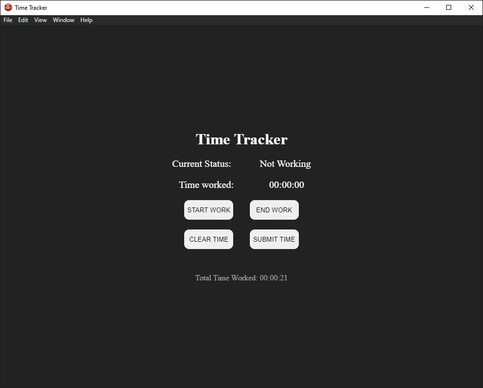

# Time-Tracker
An Electron based desktop application for tracking working hours on a project. 
The Time Tracker application uses Electron-Store for persistent storage to allow the user to continue tracking time when using the app next.

